# Projet ESE – Chat Robot  

Le projet de Chat Robot développé dans le cadre de la spécialité ESE dirigée par M.Fiack et supervisée par lui et M. Papazogou s'est achevé le vendredi 16 Janvier 2026. 

Nous allons donc revenir ici sur les différents aspects notables du projet, notamment ceux où notre projet s'est détaché des consignes initiales.

Nous allons donc passer en revue les différentes parties du projet en commençant par une partie sur l'organisation du projet et des tâches attribuées aux différents membres de l'équipe puis nous aborderons la partie Hardware séparée en deux sous parties, l'une pour la modélisation 3D sous Onshape et l'autre pour la conception de PCB sous Kicad. Puis, nous aborderons la partie Software séparée en plusieurs parties, chachune abordant un composant important du projet. 

Par soucis de lisibilité de l'ensemble du document nous n'allons pas détaillé en profondeur toutes les parties et sous parties liées à la mise en place de chaque composant sur le PCB ou à leur programmation. À la place, nous expliquerons brièvement l'ensemble des logiques hardware et software pour ensuite analyser en profondeurs seulement certains aspects de ces parties.

## Organisation du Projet

Le projet a été porté par une équipe de quatres étudiants de 3ème année à l'ENSEA faisant partit de la spécialité ESE, cette équipe est composée de : 

- Vincent FERNANDES
- Paul CAILLAUD
- Kelly LUO
- Yimei Xia

Après diverses discussions au cours du semestre, voici comment ont été attribués les rôles concernant le projet : 

- Vincent : PCB, modélisation/impression 3D, Soudure CMS & THT, TOFs, Moteurs, LED, LiDAR, mise en commun du code sous FreeRTOS
- Paul : Modélisation 3D, cablâge, Soudure CMS & THT, Accéléromètre, Moteurs
- Kelly : Lidar
- Yimei : Accéléromètre

Par ailleurs un README relatant l'avancée à mi-parcours (13 Novembre) est disponible dans le dossier Gestion.

## Hardware

### Modélisation 3D

Pour notre projet, nous avons décidés d'utiliser un pack de batteries Li-ion 2S au lieu du pack de 5 batteries NIMH fournit à la base car cela nous apporte une stabilité de maintient de la tension aux bornes de la batterie ainsi qu'une simplicité de la recharge. En effet, pour recharger les batteries que nous utilisions il nous fallait simplement les connecter à n'importe quelle alimentation stabilisée à 8.4V et non pas un chargeur dédié comme pour les batteries NIMH.

Cela étant, dû au fait d'avoir modifier les batteries nous avons dû adapter notre modélisation 3D. Nous avons donc décider d'inclure la pack de batteries directement dans la base du robot comme présenté ci-dessous afin d'augmenter la stabilité de l'ensemble. Cependant, cela a eu pour effet d'augmenter le diamètre de la base de notre robot passant d'une quinzaine de centrimètre à une vingtaine. De plus, nous avons ajouté un cache sur le dessus de la base pour bloquer la batterie en cas de chute ou autre accident. Finalement nous avons également équipé la base d'un arceau afin d'accueillir un bandeau de LED Neopixel ws2812b. 

<figure style="display:flex; gap:5px;">
  <figure style="text-align:center;">
    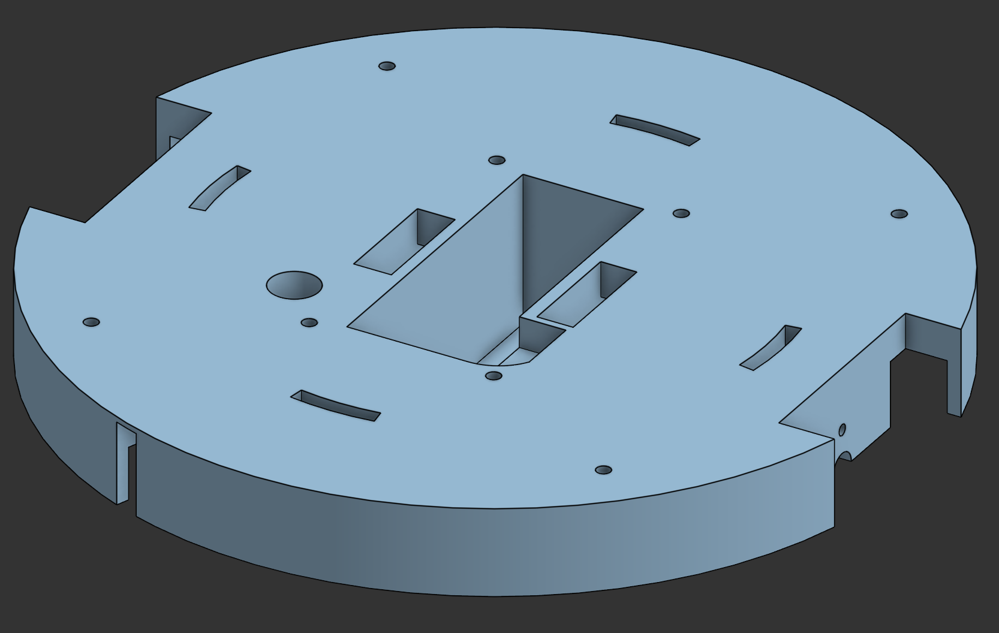
    <figcaption>Base vue du dessus</figcaption>
  </figure>
  <figure style="text-align:center;">
    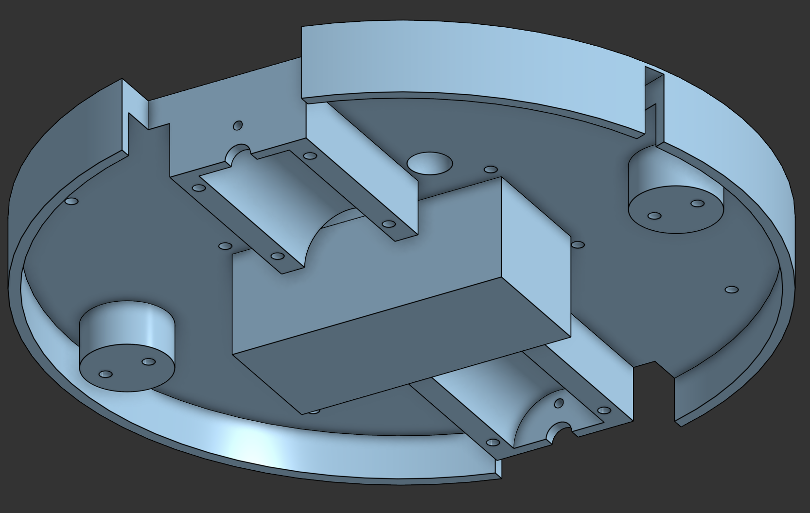
    <figcaption>Base vue du dessous</figcaption>
  </figure>
</figure>
<figure style="display:flex; gap:5px;">
  <figure style="text-align:center;">
    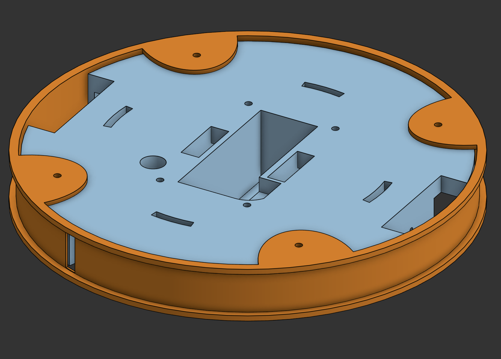
    <figcaption>Support de LED</figcaption>
  </figure>
  <figure style="text-align:center;">
    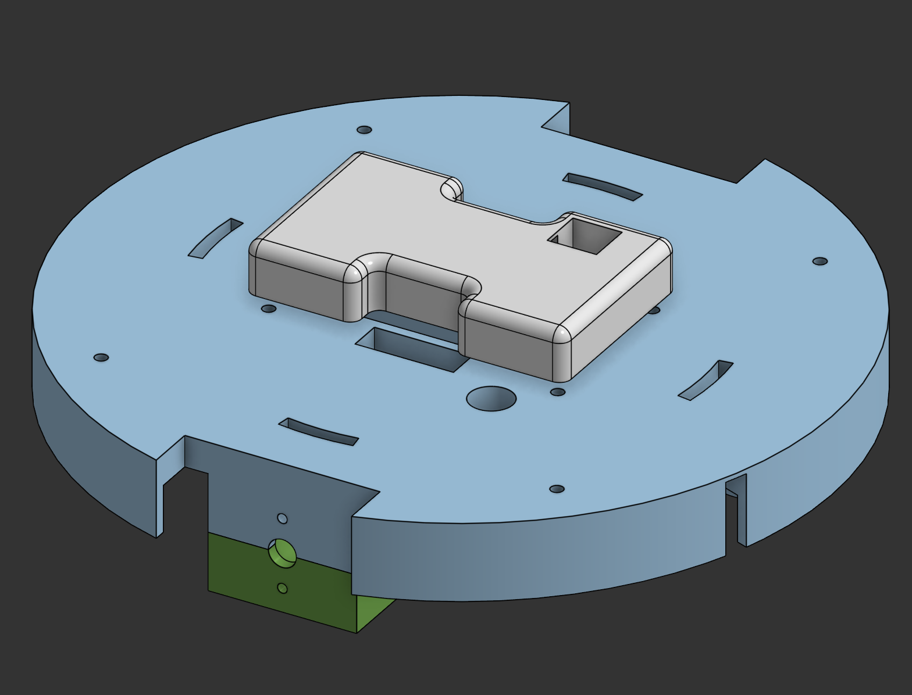
    <figcaption>Cache de la batterie</figcaption>
  </figure>
</figure>

Contrairement aux autres robots, nous n'avons fait qu'un unique étage, sur lequel sont placé les 6 TOFs et le LiDAR, afin d'avoir la place entre le cache de la batterie et le sol de cet étage de placer le PCB suspendu par des vis M3 et bloqué par les écrous correspondants.

<figure style="display:flex; gap:16px;">
  <figure style="text-align:center;">
    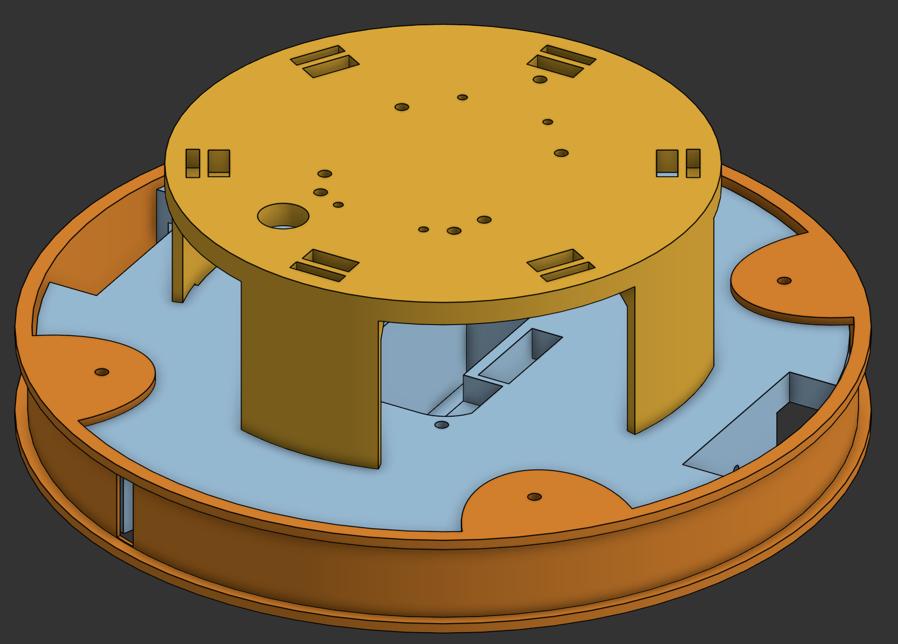
    <figcaption>Étage du robot</figcaption>
  </figure>
  <figure style="text-align:center;">
    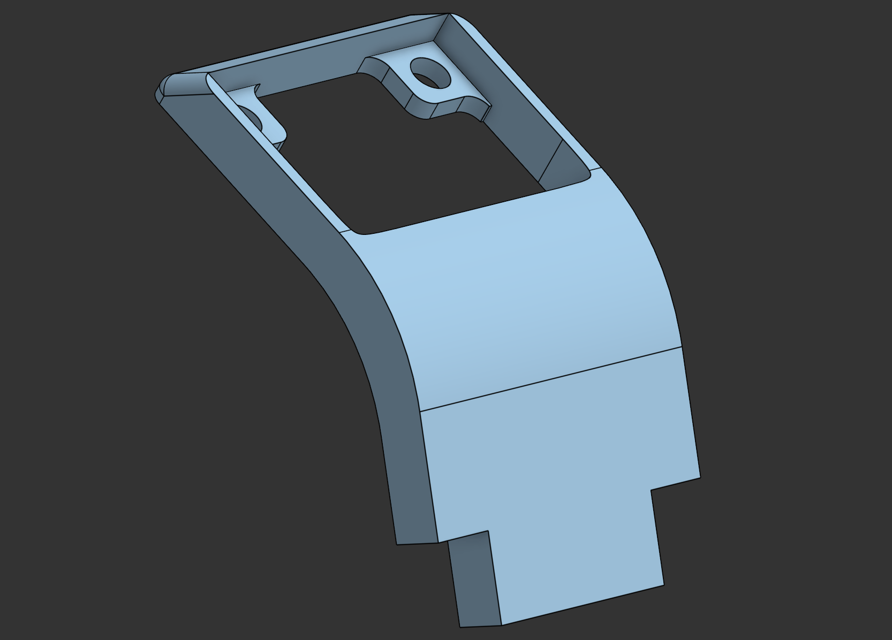
    <figcaption>Support de TOF</figcaption>
  </figure>
</figure>

De plus, nous avons également modifier les roues afin d'y inclure non pas un mais deux joints toriques par roue afin, encore une fois, de garantir une meilleur stabilité du robot au vu de sa taille. Cependant, cela complexifie légèrement les virages que peut effectuer le robot là où les lignes droites sont cependant meilleures. 
De plus, pour équilibrer le robot nous utilisons des billes en métal dont le support initial accepte uniquement des vis M2 or nous n'avons pas réussi à trouver des vis de ce diamètre assez longues pour être compatible avec notre modélisation. Ainsi, nous avons recréés des supports inspirés des initiaux mais utilisant des vis M3 car nous les avions à la longueur adéquate et à cela s'ajoute qu'utiliser des vis de plus gros diamètre permet de joindre plus solidement les 2 pièces.

<figure style="display:flex; gap:16px;">
  <figure style="text-align:center">
    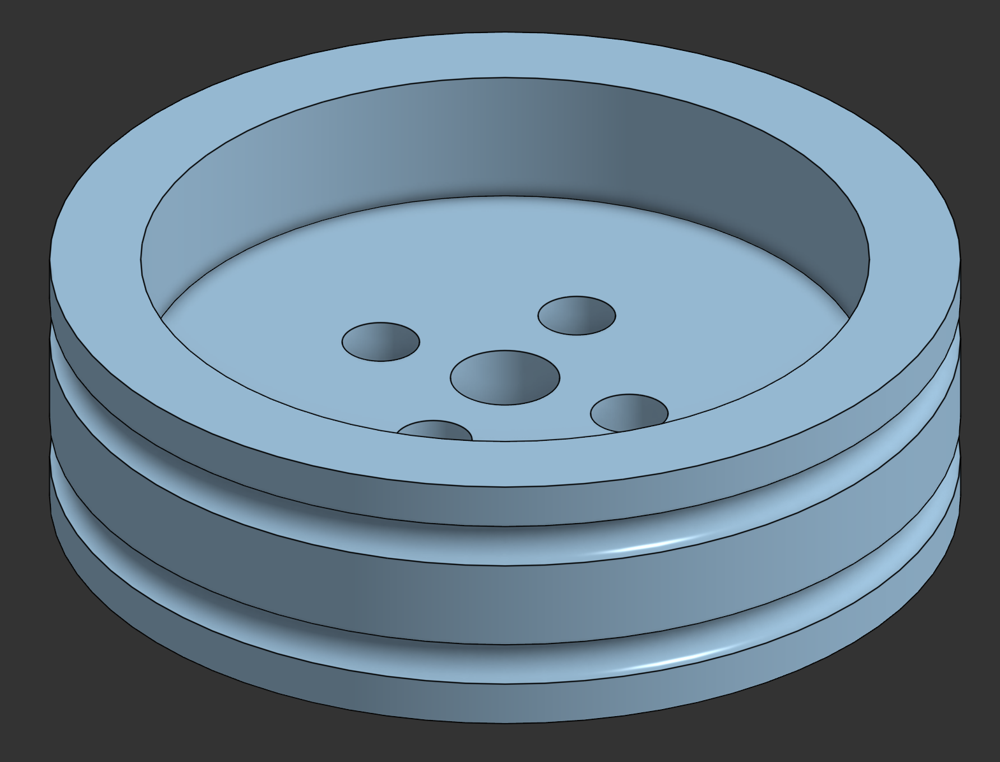
    <figcaption>Roue</figcaption>
  </figure>
  <figure style="text-align:center">
    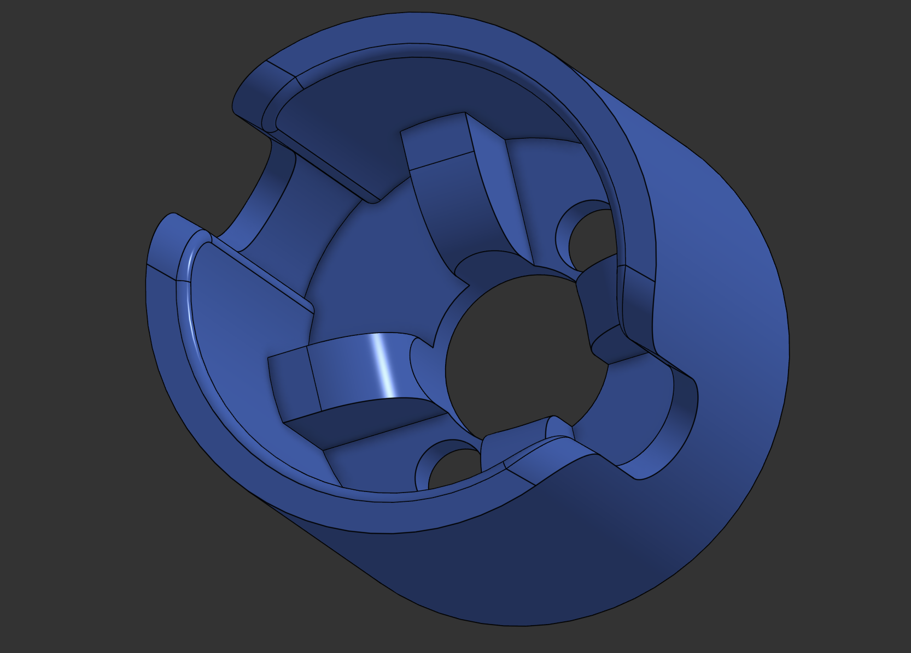
    <figcaption>Support de bille</figcaption>
  </figure>
</figure>

### PCB

Pour la conception de PCB nous sommes passés par le logiciel KiCAD et nous en avons créés 4 différents pour certaines raisons que nous expliquerons au fur et à mesure de l'explication générale de chaque PCB.

#### PCB v1

Ce PCB est le premier qui a été designé pour le projet de robot chat. Il inclut notamment les composants de base utiles au bon fonctionnement du robot tel que les drivers de moteurs, l'accéléromètre et les connecteurs pour les TOFs ainsi que celui pour le LiDAR. En effet, pour ce projet nous avons choisis d'utiliser une solution à base de 6 TOFs afin de détecter le vide autour de la table sur laquelle se déplace le robot. Le choix de 6 TOFs a été réfléchis afin d'avoir suffisament de TOFs pour pouvoir repérer le vide peut importe l'orientation du robot au moment d'approcher le bord de table, sans non plus utiliser une quantité non raisonnable de capteurs.

De plus, ce PCB inclut trois nouveaux éléments que l'on a décidé d'ajouter à notre robot. Le premier est un connecteur vers un module MP3 dans le but de jouer un son, défini en amont, à certains moments clés de la présentation. On peut prendre comme exemple le moment où le vide est repéré par un TOF ou bien au moment d'une collision avec un autre robot. 

Le deuxième élément est un bandeau de LED Neopixels commandé par une PWM avec DMA. Le but ici est de venir, tout comme le module MP3, indiquer la réalisation de certaines actions du robot. Par exemple, l'idée principale était d'illuminer une des 96 LEDs du bandeau dès lors que le LiDAR détecte une cible. Certaines LEDs pourraient s'allumer en rouge en direction de cibles non valides alors qu'une LED unique serait allumée en direction de l'objet valide : l'autre robot.

Finalement, le troisième élément est une Raspberry Pi zéro 2W. Nous avons choisis de l'incorporer pour, d'une part, remplacer la connexion bluetooth demandée mais également d'une autre part pour y développer une interface graphique intéractive. Cette dernière permettrait de récupérer les données captées par le robot en temps réel mais également de lui envoyer des instructions, également en temps réel grâce à une lisaion UART.

L'ajout de ces composants nous a obligés à changer le microcontrôleur fourni de base par un STM32G474RET6 possédant, au contraire de l'initial, le nombre suffisant d'HUART accessibles simultanément pour nos besoins.

<figure style="display:flex; gap:16px;">
  <figure style="text-align:center">
    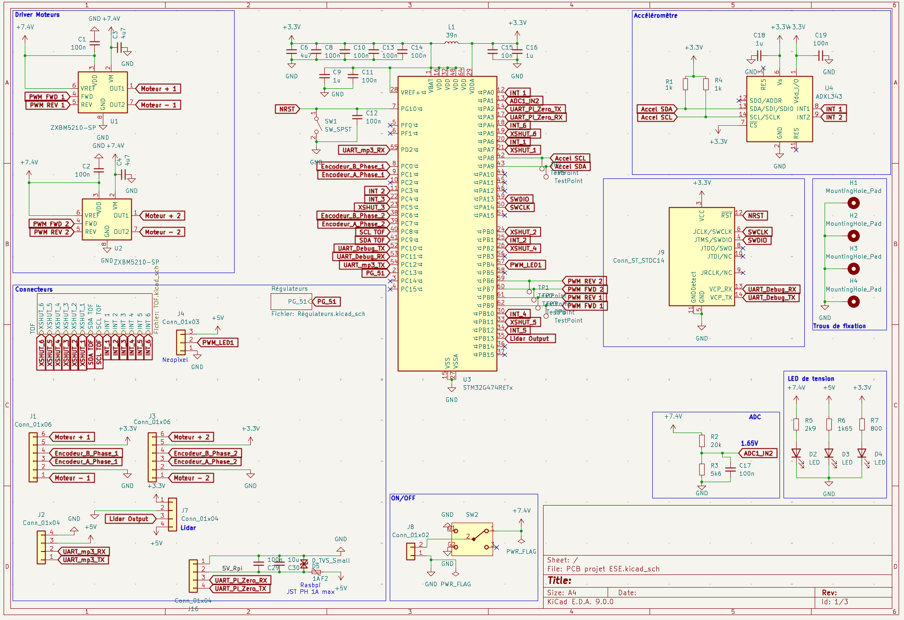
    <figcaption>Schematic</figcaption>
  </figure>
  <figure style="text-align:center">
    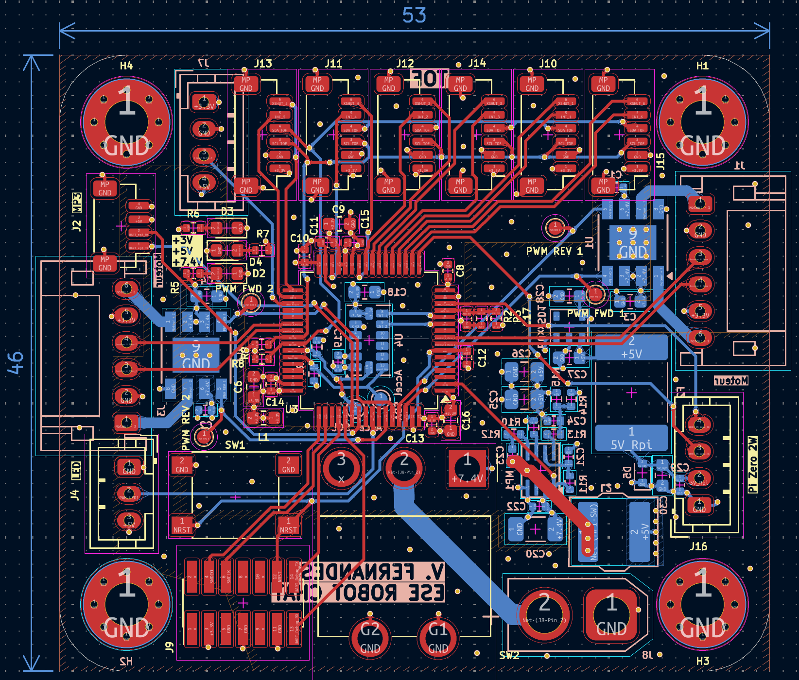
    <figcaption>PCB Editor</figcaption>
  </figure>
</figure>

Cependant, plusieurs problèmes datant de la conception sous KiCAD sont apparus une fois le PCB soudé et testé. Parmi celles-ci, les plus notables et plus importante sont les suivantes : 

- Oubli de connection de la pin ADDR de l'accéléromètre à GND (ou VCC en fonctiond de l'adresse voulue).
- Inversion des connexions SDA/SCL pour l'I2C de l'accéléromètre.
- Mauvaise connexion du pin Tx du LiDAR à un GPIO simple.
- Mauvaises connexions des pins GPIO des TOFs empêchant leur utilisation en interruption.

Même si, à la fin du projet nous avons pu en partie corriger ces erreurs de différentes façons il nous semblait essentiel de les faire apparaître dans ce compte rendu. Par exemple, nous avons connectés le LiDAR au connecteur de la Pi qui utilise également un UART et nous avons utilisés les TOFs en polling et non en interruption.

#### PCB v1.5

Cette version du PCB a été créée suite à la découverte des erreurs présentes sur la première version. Cette version a été designée dans l'idée d'avoir un PCB purement fonctionnel corrigeant les erreurs du PCB précédent tout en enlevant les éléments non nécessaires ajoutés dans la v1. Nous avons tout de même gardé le même microcontrôleur STM32G474RET6 bien que le nombre de pins soit bien plus important que nécessaire car cela nous a permis de gagné du temps en conception et le PCB a donc pu être réalisé en moins d'une journée.

<figure style="display:flex; gap:16px;">
  <figure style="text-align:center">
    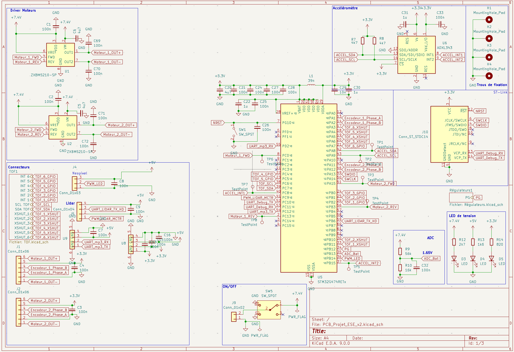
    <figcaption>Schematic</figcaption>
  </figure>
  <figure style="text-align:center">
    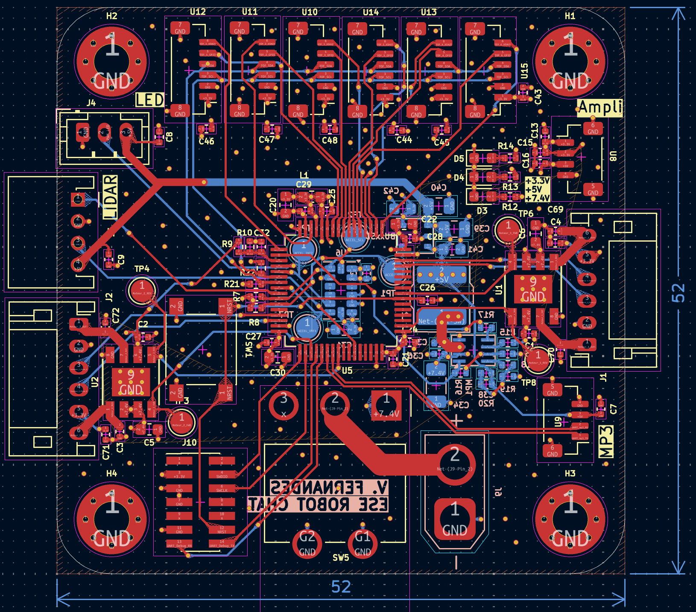
    <figcaption>PCB Editor</figcaption>
  </figure>
</figure>

Malheureusement, cette version a seulement eu le temps d'arrivée pour le jour exact de la présentation du projet car il y a eu de nombreuses semaines de retard dans la validation finale de la commande contenant ce PCB par le service déidé de l'établissement auprès du fabricant. 

#### PCB v2

Cette version est une version plus avancée du premier PCB, plus petite et comportant plus de composants et fonctionnalités. Parmi tout ces ajouts, les plus sont notables sont l'ajout d'un système de visualisation de la batterie en analogique uniquement, de résistances de shunt associées avec des amplificateurs afin de pouvoir asservir les moteurs en courant. De plus, des connecteurs pour utiliser pleinement le PCB dédié à l'amplificateur audio ainsi qu'un bouton ON-OFF-ON utilisé pour choisir le mode du robot ont été ajoutés au PCB.

<figure style="display:flex; gap:16px;">
  <figure style="text-align:center">
    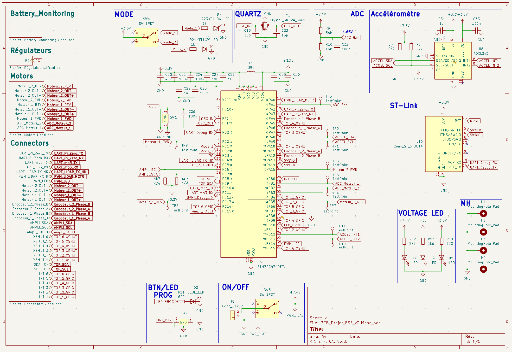
    <figcaption>Schematic</figcaption>
  </figure>
</figure>

<figure style="display:flex; gap:16px;">
  <figure style="text-align:center">
    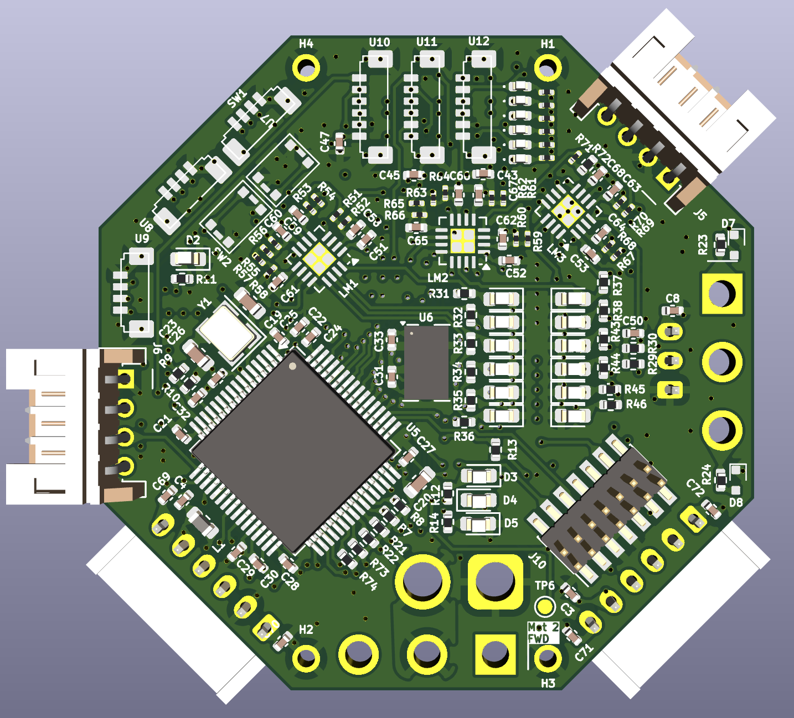
    <figcaption>Vue 3D Top</figcaption>
  </figure>
  <figure style="text-align:center">
    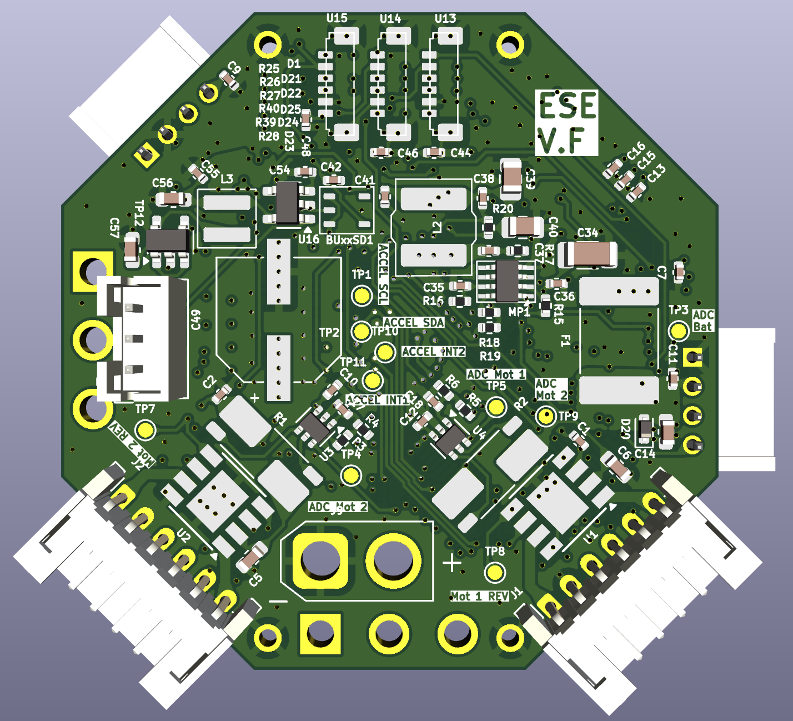
    <figcaption>Vue 3D Bottom</figcaption>
  </figure>
</figure>
  
Pour créer le système de surveillance de la batterie, des comparateurs LM339LVRTER ont été utilisés pour comparer la tension réelle de la batterie à une tension de référence qui ne varie pas même si la tension de la batterie diminue. Cette tension de référence a été créée par la mise en série d'un abaisseur de tension (MCP1802T-0902I/OT) permettant une sortie de tension de 0.9V tant que la tension d'entrée est supérieure à 2V et d'un amplificateur de tension (TPS61097A-33DBVR) permettant de ramener la tension à 3.3V qui est donc comparable à la tension réelle passée dans un diviseur de tension. Un module Buck-Boost aurait pu remplacer cette mise en série des deux composants mais nous n'en avons pas trouver permettant d'avoir ces valeurs de tension de manière stable même lorsque la tension réelle approche les 2V. 
Pour afficher le niveau de la batterie un jeu de 12 LEDs CMS a été installé sur le PCB, tant que la tension réelle est supérieure à la tension seuille, la LED associée est allumée mais dès lors que le tension réelle est inférieure à la tension seuille la LED s'éteint. Dans un soucis uniquement visuel les 12 LEDs forment un dégradé allant de vert à rouge.

Malheureusement, cette version a seulement pu être soudée (non testée) avant la présentation du projet car il y a eu de nombreuses semaines de retard dans la validation finale de la commande contenant ce PCB par le service déidé de l'établissement auprès du fabricant. 

#### PCB audio

Ce PCB très simple utilise uniquement un amplificateur audio (LM48100QMHX/NOPB) afin d'amplifier le signal en sortie du module MP3. Ce dernier utilise un câble mini-jack fonctionnant pour une utilisation en connexion directe comme avec un casque audio. Cependant cette sortie mini-jack ne fournit pas assez de puissance pour qu'un haut parleur directement connecté à celle-ci produise un son audible. Il faut donc, entre le haut-parleur et le module MP3, ajouter un amplificateur audio. 

<figure style="display:flex; gap:16px;">
  <figure style="text-align:center">
    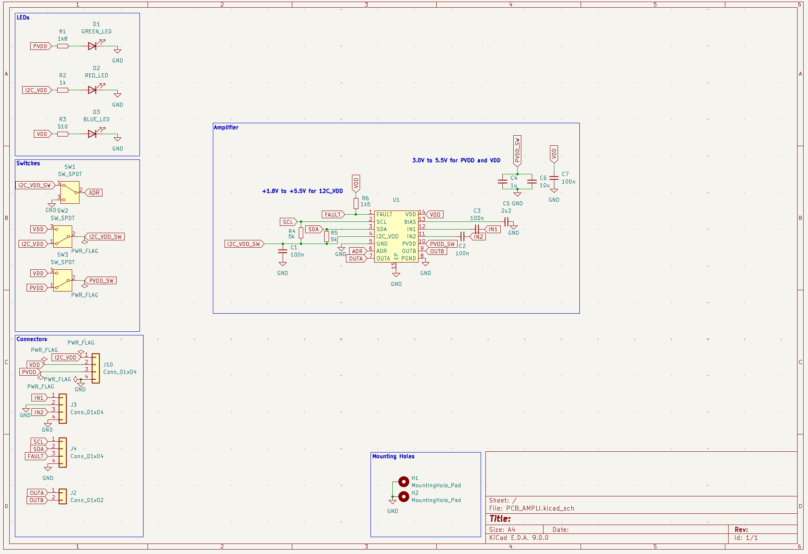
    <figcaption>Schematic</figcaption>
  </figure>
  <figure style="text-align:center">
    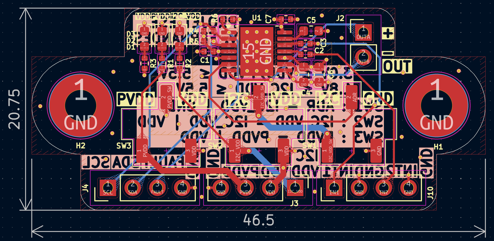
    <figcaption>PCB Editor</figcaption>
  </figure>
</figure>

Cet amplificateur audio a été choisi, tout d'abord pour ses spécificités techniques de 1W/8ohms correspondant excatement à celles de notre haut-parleur. De plus, quand la liste des choix possibles a été suffisament réduite nous avons pris le parti de choisir celui de la marque Texas Instrument car leur documentation est très lisible et compréhensible comparée à celle de leur concurrent. Cela nous permet, par exemple, de réduire le temps passé tant sur la partie hardware que sur la partie software de ce PCB. De plus, La communication I2C de cet l'amplificateur permet de modifier le volume en sortie sur 28 niveaux différents, ce qui est encore un autre avantage de ce dernier. Le seul "inconvénient", s'il faut en citer un, est le fait que le composant soit de base dans un état de veille et qu'il doit être "réveillé" grâce à l'écriture dans l'un de ses registres via la communication I2C, ce qui oblige à toujours devoir le connecté en I2C pour qu'il fonctionne.

## Software 

Des précisions supplémentaires pour les parties de Kelly LUO sont disponibles [ici](/software/README.md).

### LiDAR

Le LiDAR est l'élément qui permet au robot de :
- détecter la cible à pourchasser lorsque le robot est en mode chat.
- détecter la cible à fuir lorsque le robot est en mode souris.

Le YDLIDAR X2, fournit et imposé, communique en liaison UART avec le MCU du PCB. Comme il n'a qu'une seule broche Tx pour cette liaison, nous avons décidé de réglé l'UART en mode Half-Duplex car comme nous ne faisons que recevoir des données il n'est pas nécessaire d'avoir une liaison utilisant Tx et Rx.

Ce LiDAR transmet 3000 trames, chacune contenant plusieurs points, par seconde et effectue entre 5 et 8 tours par secondes en fonction de la tension (ou PWM) appliquée sur le pin M_CTR du LiDAR. Pour avoir une meilleure précision nous avons préférés travailler avec une vitesse entre 6 et 8 tours par secondes.

Le code associé au LiDAR est disponible en 2 versions, l'un créée par Kelly LUO est fonctionnelle sur la nucleo-L476RG mais pas sur le MCU du projet et est disponible dans le dossier : "lidar_nucleo". La seconde version créée par Vincent FERNANDES est adaptée au MCU du projet mais n'a pas pu être finie à temps pour la présentation du projet.

Ci-dessous, les explications du code de la première version par Kelly LUO : 
  
La YDLIDAR X2 est interfacé en UART avec notre micro controleur et les données envoyés suit un protocole particulier.
Pour atteindre notre objectif, il nous a d'abord fallut traiter les informations reçu. Les trames reçu comportais beaucoup de valeur nulle, qui ne correspondait pas à un distance nulle, mais plus à un signal envoyé et non reçu. Nous avons décider de stocker les distances de plusieurs trames, pour avoir une image de l'environnement plus complète. Ensuite, nous avons mis en place un algorithme de détection de cible. L'algorithme mis en place est assez précis, mais je pense qu'il est lourd en calcul. Peut être qu'un algorithme plus simple aurait été plus adapté pour notre utilisation.

Ci-dessous, les explications du code de la seconde version par Vincent FERNANDES : 

L'objectif est ici de repérer une cible déterminée comme valide et d'agir en conséquence en fonction du mode (chat ou souris) dans lequel se trouve le robot. 

Pour effectuer ce travail, nous avons choisis d'analyser tour par tour ce que percevait le LiDAR. Pour ce faire nous surveillons un bit précis du protocole du LiDAR qui est à 1 lorsque qu'un nouveau tour est entammé.

Pour chaque tour nous traitons les trames et en récupérons l'ensemble des points ayant chacun les attributs "distance" et "angle", ce qui nous permet de "dessiner" un cercle de ce que perçoit le LiDAR à chacun de ces tours. 

Afin d'éviter d'inclure des distances éronnées dans ce cercle nous limitons la distance maximale tel que si la distance d'un point est perçue supérieure à celle-ci alors nous lui attribuons pour valeur celle de la distance maximale choisie. 

Pour déterminer le nombre d'objets et leur position respectives nous utilisons l'algorithme suivant : 

1. Dans une boucle allant du premier au dernier point du cercle, choisir un point i.
2. Comparer la valeur de distance de ce point i à un seuil.
3. Si la distance du point i est inférieure au seuil alors faire de même pour les 4 points suivants, moyenner et comparer la moyenne au seuil sinon passer au point suivant.
4. Si la valeur moyennée est également inférieure au seuil alors enregistrer le point i comme premier point de l'objet j puis enregistrer tout les points qui suivent comme faisant partis de l'objet jusqu'à ce qu'un point i+n contredisant l'étape 3 apparaisse, ce point est alors enregistrer comme le point de fin de l'objet.
5. Répeter cette boucle pour tout les points du cercle.
6. Pour chaque objet enregistré, déterminer le diamètre réel de celui-ci grâce aux équations d'Al-Kashi.
7. Si le diamètre calculé est égal à un diamètre prédéfinis avec une certaine incertitude alors l'objet est considéré comme valide sinon il est considéré comme ne l'étant pas.
8. Pour l'objet valide, récupérer le point de l'objet ayant la distance la plus courte au LiDAR.
9. Diriger le robot en direction de l'angle associé au point récupérer à l'étape précédente.
10. Si plusieurs objets sont valides, calculer la distance moyenne de leurs points et se diriger vers le point de l'étape 8 pour l'objet ayant la moyenne de distance la plus basse.
11. À la fin du traitement du tour, vider l'ensemble des buffers puis recommencer.

Cet algorithme est assez lourd mais cela ne pose pas de problème majeur dans notre cas particulier car le STM32G474RET6 possède suffisament de RAM pour le traiter. Avec plus de temps, un algorithme plus léger aurait surement pu être trouvé.

### Moteurs

Les moteurs sont un élement essentiel du projet puisqu'il faut que le robot puisse se déplacer sur la table. Nous avons à notre disposition des moteurs FIT0520 qui seront chacuns pilotés par un driver. Nous avons fait le choix de faire une structure par moteur, cette dernière contenant le timer qui correspond à la PWM qui sera appliquée, la direction (Forward ou Reverse), la vitesse ainsi que le channel pour le timer. Un deuxième type de structure a ensuite été créé, celle du PID qui contient les valeurs des coefficients du correcteur afin de bien asservir le moteur. Il faut cependant noter que nous n'avons pas eu le temps de bien mettre en place le correcteur, les valeures ne sont donc pas les bonnes. Nous avons ensuite eu l'idée d'une autre structure appelée Robot qui comprend les deux moteurs et les PID, nous ne nous en sommes au final pas servis car nous controlions chaque moteur séparément.

<figure style="display:flex; gap:16px;">
  <figure style="text-align:center">
    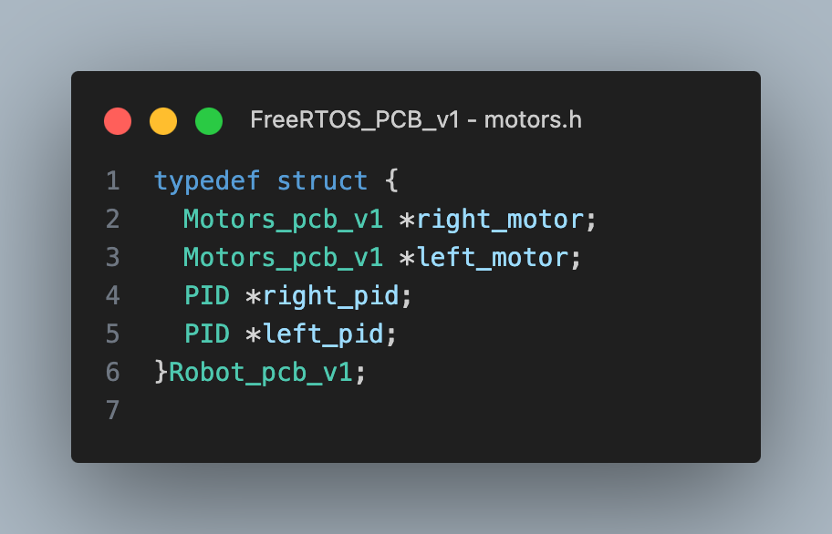
    <figcaption>Structure du Robot</figcaption>
  </figure>
  <figure style="text-align:center">
    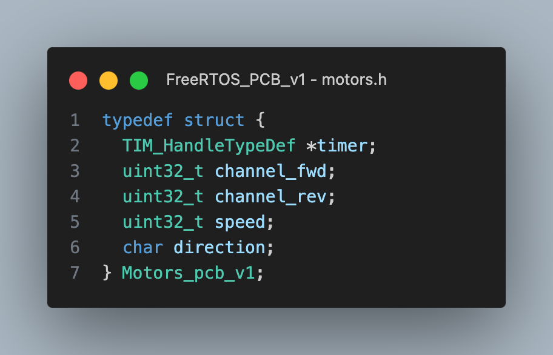
    <figcaption>Structure d'un moteur</figcaption>
  </figure>
  <figure style="text-align:center">
    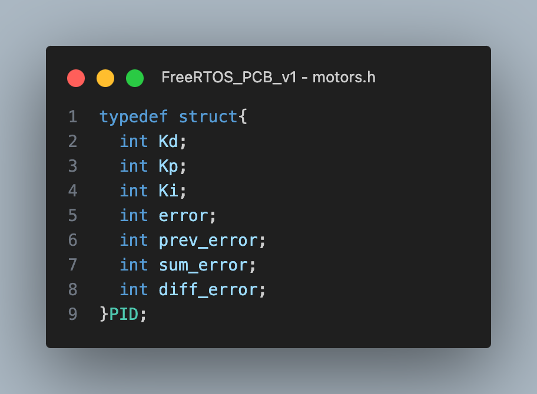
    <figcaption>Structure du PID</figcaption>
  </figure>
</figure>

Dans le .c, on commence par initialiser chaque moteur, en fournissant le timer ainsi qu'un channel pour "Forward" et un autre pour "Reverse", une vitesse nulle et la direction Forward. (On retrouve aussi les initialisations des autres structures).
Il a ensuite fallu réaliser les différentes fonctions des moteurs, start, stop, ainsi que les changements de direction et les changements de vitesse. En exemple, pour la fonction moteur_forward, le code commence par vérifier quel moteur appelle la fonction, ensuite la PWM correspondante au bon moteur Forward est démarrée. La direction Reverse est éteinte, et ce même si le moteur était arrété précédement.

<figure style="display:flex; gap:16px;">
  <figure style="text-align:center">
    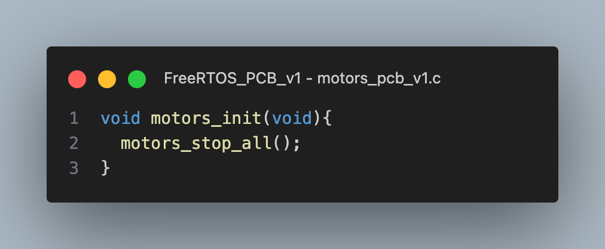
    <figcaption>Fonction d'initialisation</figcaption>
  </figure>
  <figure style="text-align:center">
    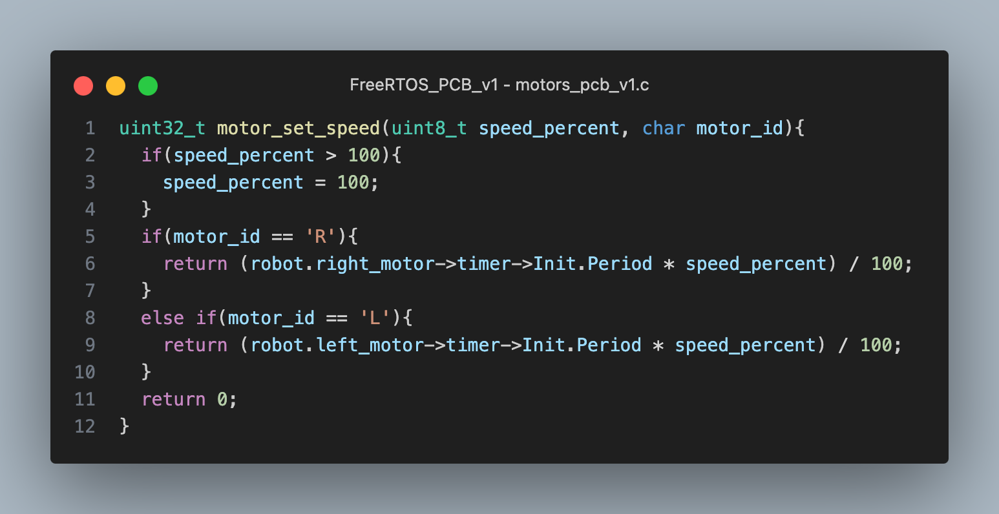
    <figcaption>Fonction de choix de la vitesse</figcaption>
  </figure>
  <figure style="text-align:center">
    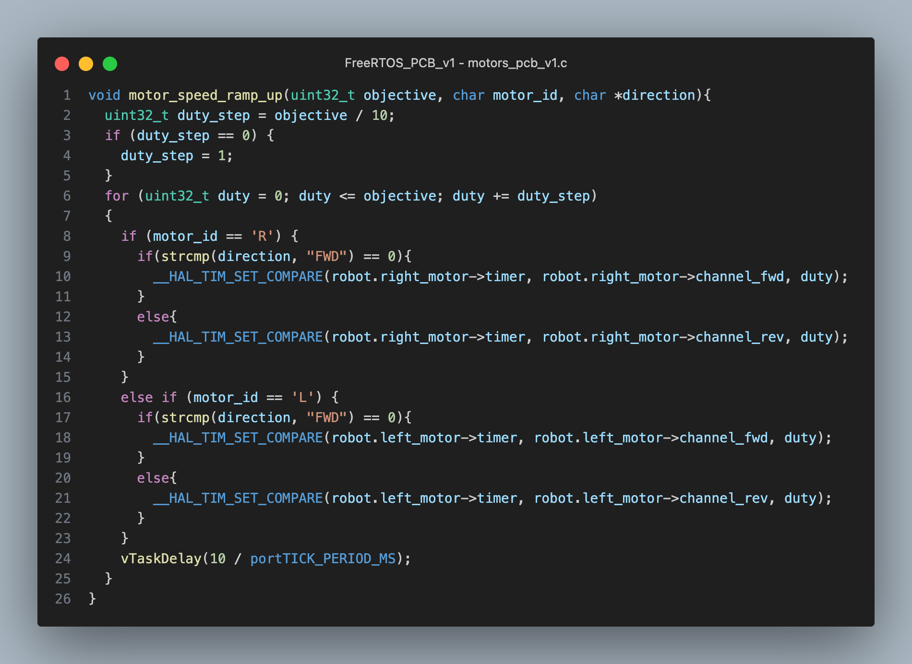
    <figcaption>Fonction rampe de vitesse</figcaption>
  </figure>
</figure>

<figure style="display:flex; gap:16px;">
  <figure style="text-align:center">
    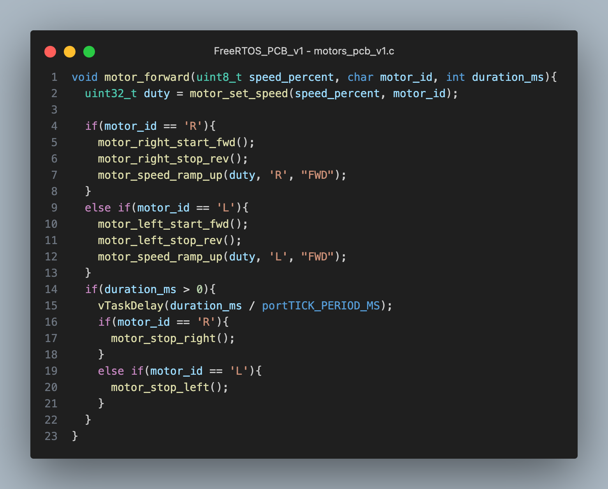
    <figcaption>Fonction pour avancer</figcaption>
  </figure>
  <figure style="text-align:center">
    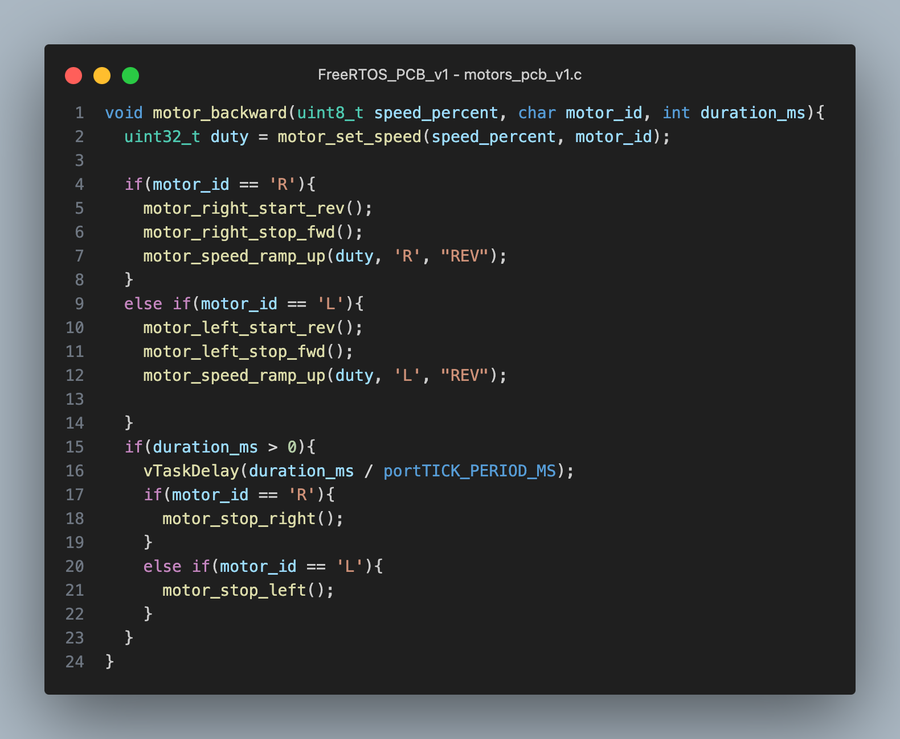
    <figcaption>Fonction de recul</figcaption>
  </figure>
  <figure style="text-align:center">
    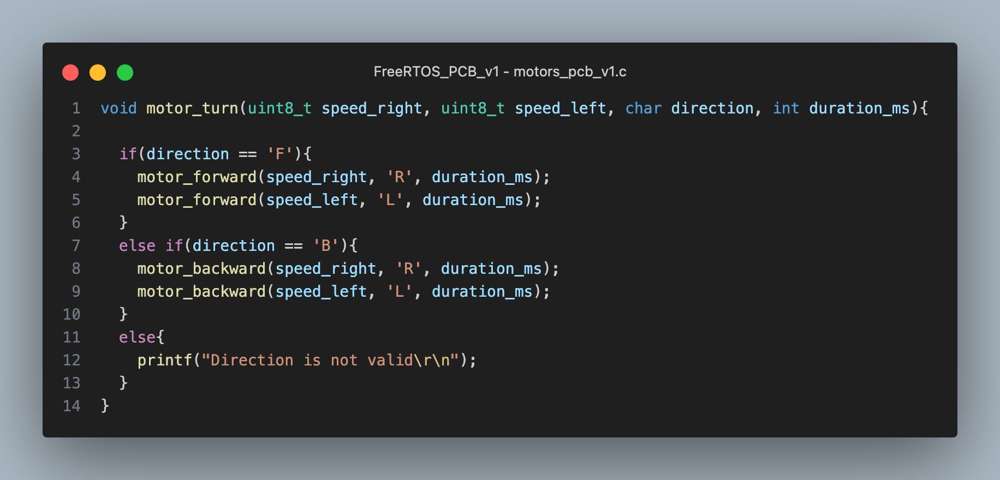
    <figcaption>Fonction pour tourner</figcaption>
  </figure>
</figure>

### TOF

Pour ce projet, nous utilisons 6 TOFs VL53L0X. Comme notre MCU possède un nombre de pins suffisants nous n'avons pas eu besoin de passer par un multiplexeur I2C pour travailler indépendamment avec chacun des six TOFs. En effet, dans la plupart des cas un multiplexeur est utilisé car ces TOFs ont une adresse fixe identique qui peut être modifiée mais nécessite une ligne supplémentaire par TOF pour connecter le pin XSHUT permettant de mettre en veille ou de reveillé un TOF. En effet, avant toute chose, pour travailler avec les 6 TOFs nous avons besoin de les initialisés avec chacun une adresses différente, pour ce faire nous utilisons les fonctions suivantes : 

<figure style="display:flex; gap:16px;">
  <figure style="text-align:center">
    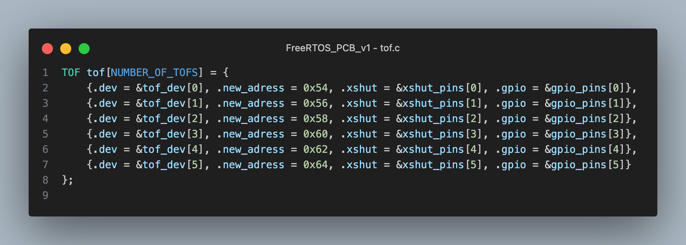
    <figcaption>Structure des nouvelles adresses des TOFs</figcaption>
  </figure>
  <figure style="text-align:center">
    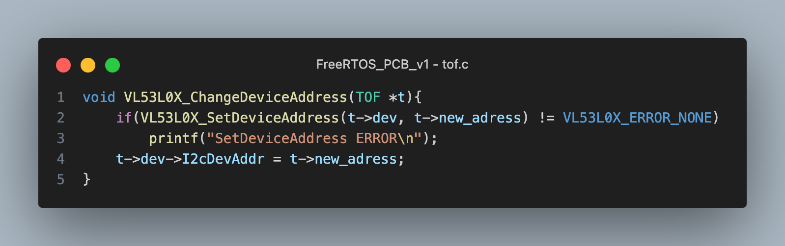
    <figcaption>Fonction de changement d'adresse</figcaption>
  </figure>
  <figure style="text-align:center">
    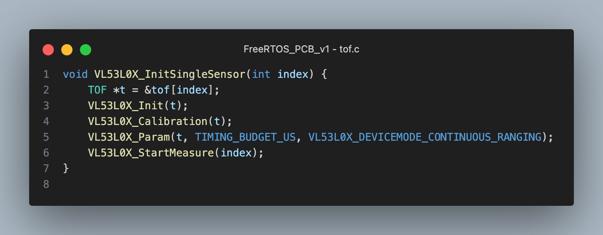
    <figcaption>Fonction d'initialisation d'un TOF</figcaption>
  </figure>
</figure>
<figure style="display:flex; gap:16px;">
  <figure style="text-align:center">
    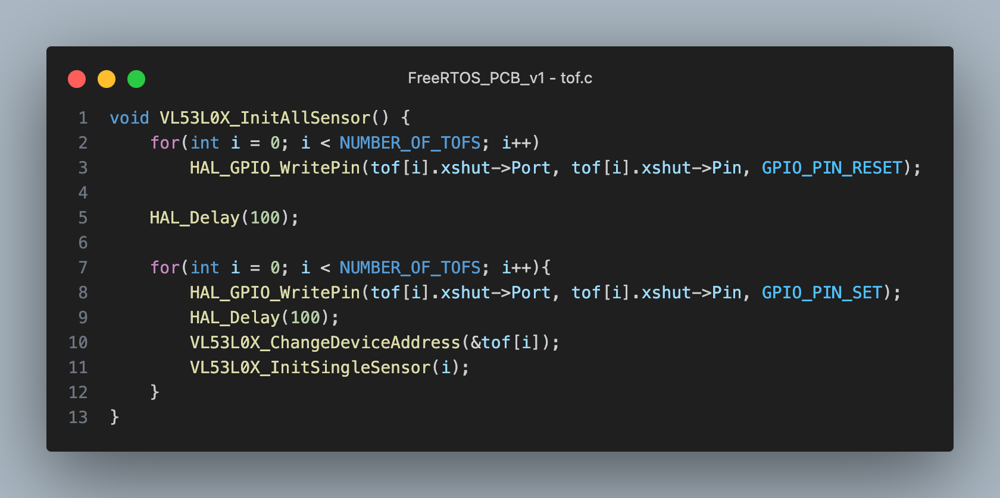
    <figcaption>Fonction d'initialisation de tous les TOFs</figcaption>
  </figure>
</figure>

L'ojectif des TOFs est uniquement de savoir si la distance perçue par le TOF est supérieure à une certaine distance seuil ou non. Dans le cas où la distance est supérieure à ce seuil alors le TOF "voit" le vide (en partant du principe que le robot est sur une table ou autre comme prévu dans l'énoncé du projet). 

<figure style="display:flex; gap:16px;">
  <figure style="text-align:center">
    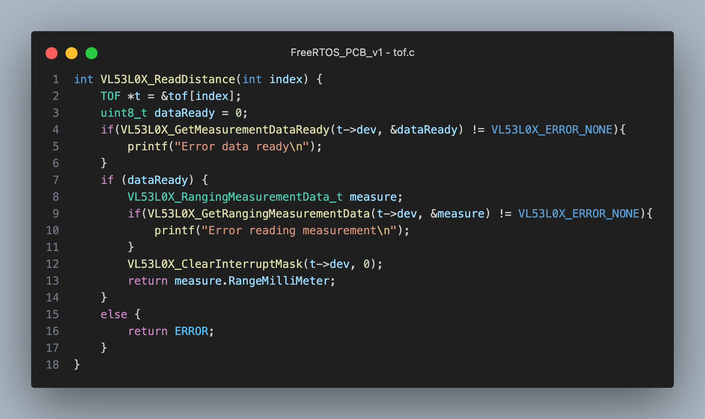
    <figcaption>Fonction de lecture de la distance en mm</figcaption>
  </figure>
  <figure style="text-align:center">
    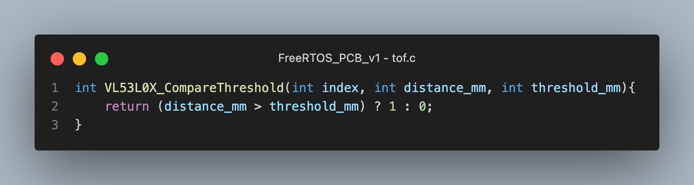
    <figcaption>Fonction de comparaison au seuil</figcaption>
  </figure>
</figure>

<figure style="display:flex; gap:16px;">
  <figure style="text-align:center">
    
    <figcaption>Fonction de détection de seuil</figcaption>
  </figure>
</figure>

Dans le code principal il s'agit donc de vérifier un à un chacun des TOFs pour savoir si l'un d'entre eux perçoit une distance qui dépasse le seuil et si c'est le cas alors une mesure d'évitement est activée.

<figure style="display:flex; gap:16px;">
  <figure style="text-align:center">
    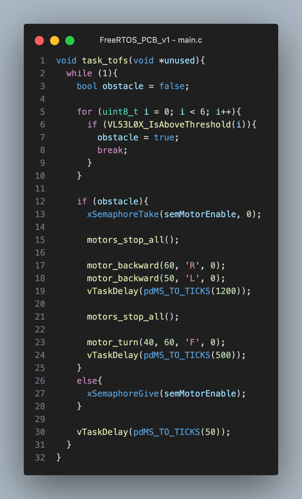
    <figcaption>Tâche FreeRTOS des TOFs</figcaption>
  </figure>
</figure>

### Accéléromètre

L'accéléromètre que nous utilisons ici est l'ADXL343, il est l'élément du robot qui va nous permettre de mettre à jour le rôle du robot, souris ou chat, dès lors qu'il y a un contact avec le robot adverse.

Une version de test de ce composant existe dans le dossier acc_test mais nous n'avons pas eu le temps d'implémenter cette partie dans le projet global (dossier FreeRTOS_PCB_v1). De plus, les conclusions des tests n'ont pas été partagées entre les membres de l'équipe donc nous ne pouvons pas affirmer si le code présent dans acc_test est correct ou non. 

D'un point de vue global, l'accéléromètre travaille sur les trois axes X,Y et Z et peut renvoyer les valeurs d'accélérations sur un ou plusieurs de ces axes en fonctions de la configuration des registres. Afin de détecter un contact avec le robot adverse on peut utiliser des registres permettant de répérer un Single-Tap ou un Double-Tap, cependant la question de la sensibilité du tap peut se poser. Une autre façon serait de comparer directement dans une fonction l'accélération reçue sur un ou plusieurs axes et la ou les comparées à un ou plusieurs seuils.

### LEDs

Comme expliqué rapidement dans la partie Hardware, nous utilisons pour ce projet un bandeau de LED Neopixel permettant d'indiquer selon quelles directions sont repérées les différents objets et parmi eu le robot adversaire via une LED d'une couleur différente des autres.
Pour réaliser cela nous avons repris une librairie créée par notre professeur afin d'envoyer un signal PWM via DMA au LEDs. Pour satisfaire notre application exacte nous avons créés différentes fonctions, dont une permettant d'allumer une LED en fonction de l'angle selon lequel le LiDAR a vu l'objet.

<figure style="display:flex; gap:16px;">
  <figure style="text-align:center">
    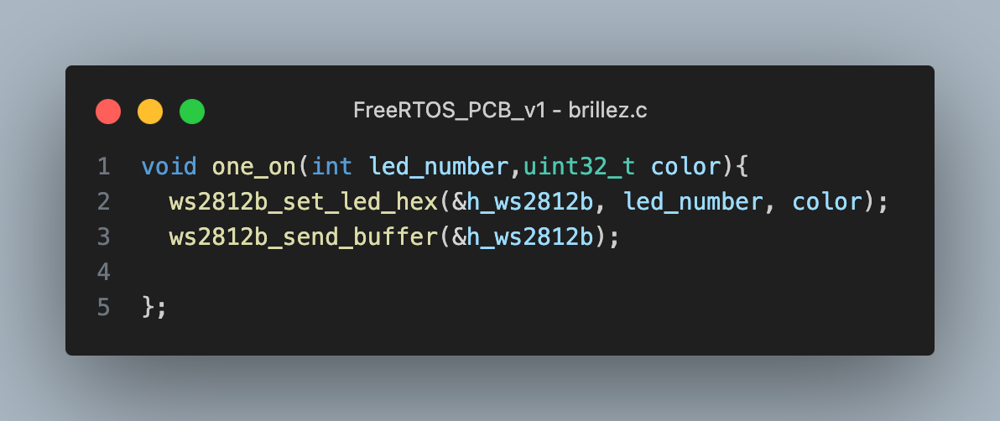
    <figcaption>Fonction pour éteindre toutes les LEDs</figcaption>
  </figure>
  <figure style="text-align:center">
    
    <figcaption>Fonction pour allumer une LED</figcaption>
  </figure>
  <figure style="text-align:center">
    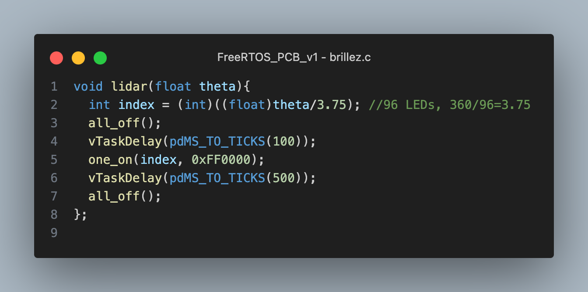
    <figcaption>Fonction liée au LiDAR</figcaption>
  </figure>
</figure>

### Audio

Pour cette partie nous utilisons un driver créé dans un projet précédent pour communiquer en UART avec le module MP3 suivant : 38586 (GoTronic). Ce module contient directement un port pour y insérer une carte SD avec les sons que l'on veut jouer.

Malheuresement, nous n'avons pas eu le temps de travailler sur la liaison I2C avec le PCB dédié à l'amplificateur audio et donc nous n'avons pas pu entendre le son directement sur le haut-parleur bien qu'il soit écoutable directement avec un casque branché en mini-jack sur le module MP3.

### Raspberry Pi zero 2W

Cette partie n'ayant pas pu être traitée dans le temps impartis nous allons simplement revenir sur les aspects que la Raspberry Pi Zero 2W aurait dû ajouter au projet. 

Dans un premier temps, la Pi aurait du permettre d'afficher les données essentielles liées au robot par l'intermédiaire d'une liaison UART cadencée à 1 Mo de baud rate. Pour afficher ces données, il était prévu d'héberger sur la Pi un serveur Nginx afin de pouvoir, par cet intermédiaire, accéder à une interface graphique indiquant l'ensemble des données reçues ainsi que la "vision" du robot via un module camera Raspberry Pi connecté à la Pi zero 2W. 

De plus, l'ajout de cette Pi aurait dû permettre un contrôle du robot selon deux autres modes en plus de celui demandé initialement. En effet, le premier mode aurait été un contrôle à la manette type controller pro de Switch connécté en Bluetooth à la Pi et grâce à l'API gamepad en JS nous aurions pu détecter l'appui sur l'un des boutons et ainsi transmettre l'information au MCU via la liaison UART pour indiquer au robot les mouvements a effectuer. Le deuxème mode qui était prévu était un mode permettant de contrôler le robot par la voix grâce à une API Google de reconnaissance vocale dédiée.

# Résultat Final

Le résultat final a été présenté le Vendredi 16 Janvier après-midi devant les professeurs et le reste de la promotion. Pour cette démonstration finale nous avons pu montrer que le robot avance jusqu'à rencontrer un bord de table où il va reculer puis tourner vers la droite et répéter cette procédure indéfiniment. 

<figure style="display:flex; gap:16px;">
  <figure style="text-align:center">
    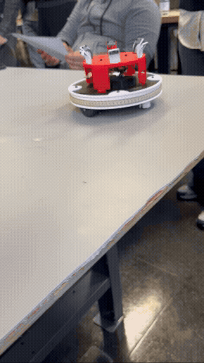
  </figure>
</figure>
